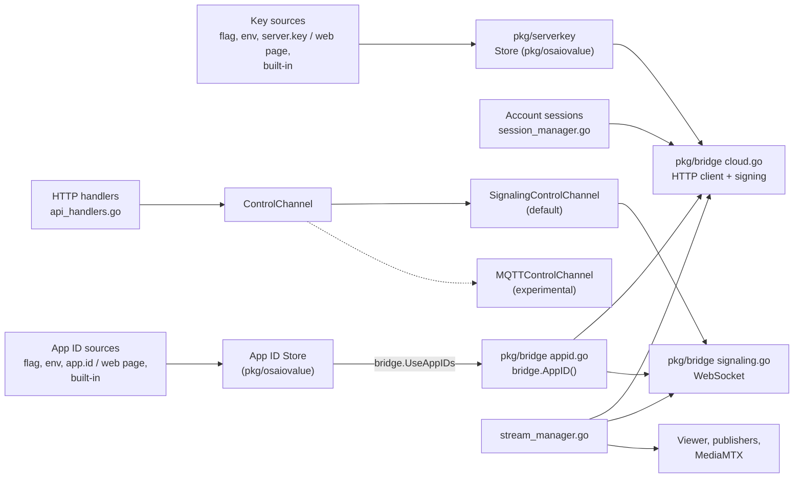

# Architecture

BombeCam is one Go program, `bombecam-gateway`, plus Linux helper programs for router rules. This page covers the parts that deal with the vendor's cloud: where the server key and the app ID go, how cloud traffic is kept apart from device control, and what happens when the cloud is unavailable.

## The parts

Arrows are calls at run time, except `bridge.UseAppIDs`, which installs the app ID store once at start. Device control and media never see the key or the app ID.

| Part | Where | Job | Talks to the vendor |
|---|---|---|---|
| Value store | `pkg/osaiovalue` | What the key and the app ID share: the order of sources (`Load`), the file format and checks (`Kind.Clean`, `Kind.ReadFile`, `Kind.WriteFile`), and `Store` with `Key`, `Status`, `Save` and `Reset` | No |
| Key provider | `pkg/serverkey` | The key's sources (`Kind`: `-server-key-file`, `BOMBECAM_SERVER_KEY`, `BOMBECAM_SERVER_KEY_FILE`, `server.key`), built-in key (`LatestKnown`, set at build time by `internal/buildkey`, obscured), `Provider` and `Static` | No |
| App ID | `pkg/bridge/appid.go` | The app ID's sources (`AppIDKind`: `-app-id-file`, `BOMBECAM_APP_ID`, `BOMBECAM_APP_ID_FILE`, `app.id`), built-in app ID (`LatestKnownAppID`, set at build time, obscured), `UseAppIDs`, and `AppID()`, which every request asks | No |
| Key and app ID settings | `cmd/bombecam-gateway/osaio_values.go` | What both share: loading and logging the source at start, the settings endpoint, waiting at start-up while one is missing (`waitForOsaioValues`), signing in again after a change (`resumeAfterChange`) | No |
| Key settings | `cmd/bombecam-gateway/server_key.go` | `-server-key-file`, `/api/v1/server-key` | No |
| App ID settings | `cmd/bombecam-gateway/app_id.go` | `-app-id-file`, `/api/v1/app-id`; installs the store with `bridge.UseAppIDs` | No |
| Cloud HTTP client | `pkg/bridge/cloud.go` (`Cloud`) | Sign-in, camera list, stream-session setup; signs each request | Yes |
| Cloud signaling | `pkg/bridge/signaling.go` (`Signaling`) | Live-session messages, camera commands and readback, reconnects | Yes |
| Account sessions | `session_manager.go`, `session_registry.go`, `session_renew.go` | One session per login; renews expired sign-ins | Through `Cloud` |
| Device control | `pkg/bridge/control_channel.go` (`ControlChannel`) and its implementations | Pan/tilt, night vision, lights, detection switches, talk | Cloud version: through `Signaling` |
| Media | `pkg/bridge/media.go` (`Viewer`), `native_sink.go`, `rtsp_publisher.go`, `internal/mediamtx` | Receive camera video and audio, publish RTSP/HLS/WebRTC | Session setup only |
| Web page and API | `api_handlers.go`, `onboarding_handlers.go`, `web/` | User interface and REST API | No (calls the parts above) |
| Router rules | `pkg/policy`, `pkg/renderer`, `pkg/routerpush`, `pkg/netstack`, `cmd/bombecam-net` | Block cloud video | No |

## How the key is used

1. At start, `loadServerKeys` builds a `serverkey.Store` from the first source that is set, ending with the built-in `serverkey.LatestKnown` (see [CONFIGURATION.md](CONFIGURATION.md)).
2. The same store is handed to every cloud client: `NewSessionManager`, `NewSessionRegistry` and, through them, `bridge.NewCloud`. Clones made to renew a sign-in keep it.
3. Before each request, `Cloud.sign` asks the store for the key. If there is none, the request is not sent and the error wraps `serverkey.ErrNoKey`.
4. Saving a key on the page (or going back to the built-in one) replaces it in the store, so the next request from every session uses it: a hot swap, no restart.

`serverkey.Provider` is the interface (`Key() (string, error)`). Implementations: `Store` (the gateway's, an `osaiovalue.Store`) and `Static` (tests). Anything else that can return a string can be plugged in the same way.

## How the app ID is used

The app ID comes from the same kind of store, but requests reach it through a store installed in `pkg/bridge`, not one handed to each cloud client.

1. At start, `loadAppIDs` builds an `osaiovalue.Store` for `bridge.AppIDKind` from the first source that is set (`-app-id-file`, `BOMBECAM_APP_ID`, `BOMBECAM_APP_ID_FILE`, `app.id` in the data folder), ending with the built-in `bridge.LatestKnownAppID`, and installs it with `bridge.UseAppIDs`.
2. `Cloud` asks `bridge.AppID()` before each request, and `Connect` before opening the live session. If there is none, the request is not sent and the error wraps `bridge.ErrNoAppID`.
3. When the live session reconnects, it takes the app ID in use at that moment; while none is usable it sends nothing and keeps retrying, so an app ID saved meanwhile is picked up (`TestSignalingReconnectUsesCurrentAppID`).
4. Saving an app ID on the page (or going back to the built-in one) replaces it in the store, so the next request from every session uses it: a hot swap, no restart.

Without an installed store (tests, tools), `bridge.AppID` reads `BOMBECAM_APP_ID`, `BOMBECAM_APP_ID_FILE` and the built-in app ID on every call.

Evidence: `pkg/bridge/appid_test.go` (`TestRequestsCarryTheAppID`, `TestCloudSendsNothingWithoutAppID`, `TestAppIDFromStoreAppliesAtOnce`, `TestAppIDFileFromEnvironment`), `tests/e2e/e2e_app_id_test.go`.

## Where the key and the app ID never appear

The built-in key is not in the code, and neither is the app ID: both are set at build time from `osaio-setup.txt` or `BOMBECAM_SERVER_KEY`/`BOMBECAM_APP_ID` (`internal/buildkey`, `tools/setup`), stored obscured in the binary (`internal/obscure`), and empty in a build without them ([CONFIGURATION.md](CONFIGURATION.md#building-with-a-key)). Device control, media, the encrypted profile and the log never see them. None of `/api/v1/server-key`, `/api/v1/app-id` and `/api/v1/onboarding/status` returns the key or the app ID: they report where each comes from and whether it works, and the page can only send a new one.

Evidence: `pkg/serverkey/serverkey_test.go` (`TestStatusDoesNotRevealKey`), `pkg/bridge/cloud_sign_test.go` (`TestCloudSignsWithSuppliedKey`, `TestCloudSendsNothingWithoutKey`, `TestCloneKeepsKeySource`), `tests/e2e/e2e_server_key_test.go` and `tests/e2e/e2e_app_id_test.go` (a status reply that carries a value fails them, and `AssertZeroSecrets` checks the log and the profile).

## How device control is kept apart from the cloud

HTTP handlers send camera commands only through `ControlChannel`. They get it from `cameraControl` (`main.go`), which returns the configured channel. Vendor message names and payloads stay inside the channel implementations.

- **Cloud control (default).** `SignalingControlChannel` sends commands over the camera's live signaling connection.
- **Local control (experimental).** `MQTTControlChannel` talks to a local MQTT broker. It is selected only with `-control-transport mqtt` or `-local-control-test`.

Three places still use the signaling connection directly:

- `/cmd` sends a raw vendor message for debugging; its input is already vendor-specific. This one is deliberate.
- `streamOnce` in `stream_manager.go` owns the live session and sends its keep-alive and the first settings read on it.
- `Viewer` in `pkg/bridge/media.go` sends the session's offer, candidates and keep-alive, and arms talk directly if no control channel is set.

The last two are media-session traffic, not device control; separating them is step 7 of the [plan](MODULARIZATION_PLAN.md).

Evidence: `TestAPI_SettingSwitchesUseControlChannel`, `TestAPI_CameraControlDispatch`, `TestDetectionSwitches`.

## When the cloud is not available

| Situation | What BombeCam does | Evidence |
|---|---|---|
| Configured key unusable or missing (for example a build without one, or a broken `server.key`) | Sends nothing. Status `server_key_missing`; sign-in replies `428 server_key_missing`; the page asks for a key. Startup waits and resumes when a key is saved. | `TestStartupWaitsForServerKey`, `TestE2E_ServerKey_SourceBuildWithoutKey`, `TestE2E_ServerKey_BrokenSavedKeyWaitsThenResumes` |
| Configured app ID unusable or missing (for example a build without one, or a broken `app.id`) | Sends nothing. Status `app_id_missing`; sign-in replies `428 app_id_missing`; the page asks for an app ID. Startup waits and resumes when an app ID is saved. | `TestStartupWaitsForAppID`, `TestE2E_AppID_SourceBuildWithoutAppID`, `TestE2E_AppID_SavedLoginsWaitThenResume`, `TestE2E_AppID_BrokenSavedFileWaitsThenResumes` |
| Key or password refused | Status `invalid_credentials` with a message naming the password, the key and the app ID. No retry loop. Saving a new key signs in again (including a login given at start-up) and lifts the renewal wait. | `TestServerKeyChangeRecoversSessions`, `TestE2E_ServerKey_BuiltInThenHotSwap`, `TestE2E_ServerKey_RefusedStartupLoginRetriesAfterSave` |
| App ID refused (outdated) | Same as a refused key: status `invalid_credentials`, no retry loop. Saving a new app ID signs in again (including a login given at start-up) and lifts the renewal wait. | `TestAppIDChangeRecoversSessions`, `TestE2E_AppID_BuiltInThenHotSwap`, `TestE2E_AppID_RefusedStartupLoginRetriesAfterSave` |
| Network or service down | Retries with growing delays: at start from 5 s, doubling to just over a minute; streams after 30 s, 1 min, then every 2 min. | `restoreGatewayState`, `-retry-max-wait` |
| A command cannot be sent | The request fails with an error. A sent command is reported as sent, not as confirmed; confirmation comes only from fresh camera readback. | `TestAcceptedCommandsDoNotFabricateHardwareConfirmation` |
| Local control selected and the broker is down | Fails. It never falls back to the cloud. | `TestLocalControlsNeverFallBackToAvailableCloud` |

In none of these cases are router rules removed, saved data deleted, or the local control mode switched on.

### Why controls stay on the cloud

Local control was tried and set aside: the camera's control connection only accepts the vendor's own server certificate, and modifying the camera or its firmware is not an option for this project. Controls therefore go through the vendor's cloud, while video and audio travel over the local network. The MQTT code stays in the source as a reference for anyone who continues that work (`pkg/bridge/mqtt_channel.go`, `pkg/bridge/shadow_shim`, `deploy/mosquitto`). Source: the maintainers' decision record, outside this repository.

## Settings and their format

| Setting | Format | Versioned |
|---|---|---|
| Encrypted profile (`profile.enc`) | JSON inside AES-256-GCM | Yes: `Version` field, currently `1` (`pkg/profile/types.go`). Older single-login profiles are converted on load (`Profile.Normalize`). |
| `server.key` | One text line, `#` comments allowed | No: a single value has nothing to migrate. If the format ever changes, `osaiovalue.Kind.ReadFile` (behind `serverkey.ReadFile`) must keep reading the old one. |
| `app.id` | Same format as `server.key` | No, for the same reason; it is read by the same `osaiovalue.Kind.ReadFile`. |
| `/api/v1/server-key` | JSON: `configured`, `source`, `editable`, `has_built_in`, `problem`; never the key | New fields may be added; existing ones keep their meaning. |
| `/api/v1/app-id` | Same fields as `/api/v1/server-key`; never the app ID | Same as `/api/v1/server-key`. |

## What is still tied together

These are known and listed in [MODULARIZATION_PLAN.md](MODULARIZATION_PLAN.md):

- `SessionManager`, `SessionRegistry` and `StreamManager` hold the concrete `*bridge.Cloud`, not an interface.
- `streamOnce` calls `Cloud.VideoCall`, `bridge.Connect` and `bridge.NewViewer` in sequence, so media setup depends on the concrete cloud types.
- `Viewer` holds the signaling connection, sends session messages on it, and arms talk through the control channel (or directly when none is set).
- Vendor setting names (night vision mode, status light, detection switches) appear in the gateway's readback, telemetry and MQTT-discovery code, not only in `pkg/bridge`.
- `pkg/bridge` holds cloud transport, media and control in one package.

## BombeCam's own sign-in, and room for more profiles

BombeCam's sign-in is separate from Osaio. The encrypted profile holds a list of **users**, each with a role; today there is one, the administrator, created on the PC at first start. Its password is an Argon2id hash; optional two-step sign-in keeps a TOTP secret, the last code step used (so a code works once) and hashes of the one-time recovery codes. `signInRequired` in `admin_handlers.go` is the single rule for when a request needs a signed-in session: always from other devices, and on the PC when the administrator chose so. The page's own files and the sign-in endpoints stay reachable without it.

Osaio logins (`Accounts`) and cameras are a separate pool, and no Osaio login is "main". Dependent profiles with their own Osaio logins and cameras can be added later without reshaping the saved data: add a role for them, record the owning user on each Osaio login (and so on its cameras), and filter what a signed-in user sees and may change by that owner. Sessions would also record which user signed in.
